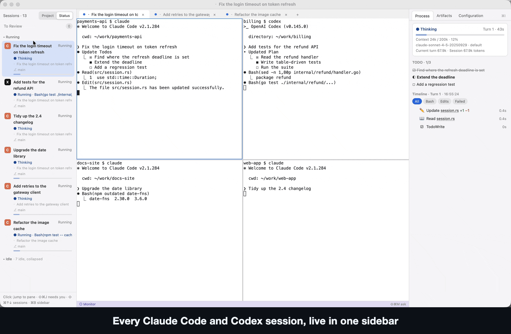
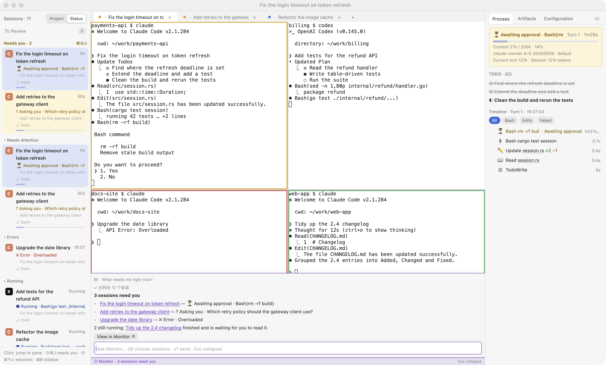

<p align="right"><b>English</b> | <a href="README.zh-CN.md">简体中文</a></p>

<h1 align="center">gilvt</h1>

<p align="center">
  A native macOS terminal for running and monitoring parallel coding agents.
  <br />
  Run Claude Code and Codex in their own TUIs, see which session needs you, and review each turn in place.
  <br />
  <a href="https://gilvt.com">Website and guides</a>
  ·
  <a href="https://gilvt.com/download">Download</a>
  ·
  <a href="#about">About</a>
  ·
  <a href="#install">Install</a>
  ·
  <a href="docs/user-guide.md">User guide</a>
  ·
  <a href="CONTRIBUTING.md">Contributing</a>
  ·
  <a href="HACKING.md">Developing</a>
</p>

<p align="center">
  
</p>

> [!NOTE]
> gilvt is an early release (0.1) and runs on macOS only. The interface follows your Mac's preferred
> language: Simplified Chinese when it is Chinese, English otherwise. Pick one in Settings (`⌘,`) →
> Language, or set `language = "en"` / `"zh-CN"` in `~/.config/gilvt/config.toml`. The developer docs ([HACKING.md](HACKING.md)) are in Chinese for now.

## About

When three or four Claude Code and Codex sessions run at once, the hard part is knowing which one
stopped to ask for approval, which one just failed its tests, and which one finished and is waiting for
you to read the result. A plain terminal gives you a grid of text and makes you check every tab.

gilvt is first a complete, everyday terminal: tabs, splits, true color, the Kitty keyboard protocol,
input methods, search and a large scrollback, rendered natively with GPU acceleration
([gpui](https://www.gpui.rs) + [alacritty_terminal](https://github.com/alacritty/alacritty)). On top of
that it understands what your coding agents are doing:

- **Sidebar**: every agent session in one list, with the ones that need you on top. `⌘⇧J` jumps to the
  next one.
- **Status at a glance**: pane borders and tab dots are colored by state (needs you · error · working ·
  done and unread).
- **Inspector**: each turn's commands, file edits, TODOs and failures as a timeline; click a row to
  scroll the terminal back to it. Per-turn file changes with a "this turn" diff.
- **Notifications** and a Dock badge when a session needs you while you are in another app.
- **Session management**: find and resume sessions from days ago (`⌘⇧R`), start a new agent in any
  directory or a fresh git worktree (`⌘⇧N`), review finished sessions offline, archive and clean up.
- **Monitor** (`⌘⇧O`): every session and terminal across all windows as cards, with optional AI
  summaries and a read-only chat about what is going on (off by default; uses your local CLI).
- **Quick Look and an editor**: code with syntax highlighting and diffs, rendered Markdown and Mermaid,
  `⌘P` fuzzy file search, and a built-in editor with live preview.
- **725 built-in themes** plus your own; the window chrome follows
  the theme.

<p align="center">
  <picture>
    <source media="(prefers-color-scheme: dark)" srcset="docs/images/gilvt-dark.png">
    
  </picture>
</p>
<p align="center"><sub>Six sessions in one window: awaiting approval, asking, running, errored and done, with the inspector timeline and the Monitor command bar.</sub></p>

Design principles:

- **Agents stay in their native TUI.** gilvt adds no chat UI and no approval buttons.
- **Observe, never answer.** gilvt shows state and moves focus; it never types into an agent.
- **Your configuration is untouched.** Shell integration and agent hooks are injected through launch
  arguments and temporary files. Your rc files, `~/.claude` and `~/.codex` are not modified unless you
  explicitly run `gilvt integrate install`.
- **Failures degrade, not break.** If hooks are missing or a transcript can't be parsed, gilvt falls back
  to a reduced mode or a plain terminal.

## Install

**[Download gilvt for macOS](https://gilvt.com/download)** (macOS 11 or later, Apple silicon and Intel;
signed and notarized). Open the disk image, drag Gilvt into Applications, and open it from there. Then run
`claude` or `codex` in a pane: the sidebar and inspector pick up the session automatically. The app keeps
itself up to date and installs updates when you quit. More on [gilvt.com](https://gilvt.com/install/).

### Build from source

Requirements: macOS, Xcode Command Line Tools, and Rust (the pinned toolchain in `rust-toolchain.toml`
is selected automatically by `rustup`). A full Xcode install is not needed.

```bash
git clone https://github.com/Gilvt-WTJ/gilvt.git
cd gilvt
scripts/bundle.sh release          # builds and signs target/release/Gilvt.app
open target/release/Gilvt.app
```

Build outside `/tmp` (macOS ignores app bundles there). Native notifications and the Dock badge need
the app bundle. To keep macOS privacy grants across rebuilds, create a self-signed `gilvt-dev`
certificate as described in [HACKING.md](HACKING.md) (稳定签名). Builds from source have no updater.

## Documentation

- [User guide](docs/user-guide.md) (a formatted edition is in `docs/user-guide.html`; open it in a browser)
- [Coding-agent guides](https://gilvt.com/guides/) and
  [Claude Code / Codex integrations](https://gilvt.com/integrations/)
- [Developing gilvt](HACKING.md): build, layout and implementation notes (Chinese)
- [Acceptance checklist](docs/compat-checklist.md) and [GUI tests](tests/gui/README.md)
- [Design documents](docs/design/)

## Privacy

gilvt has no telemetry and makes no network requests of its own. It reads Claude Code and Codex
session files on your machine to show their state. The optional Monitor summaries and chat run your
own `claude` or `codex` CLI, which talks to its provider as usual. See [PRIVACY.md](PRIVACY.md).

## Contributing

Bug reports and focused pull requests are welcome. Please read [CONTRIBUTING.md](CONTRIBUTING.md) and
the [AI usage policy](AI_POLICY.md) first. Security issues: see [SECURITY.md](SECURITY.md).

## Disclaimer

gilvt is an independent project. It is not affiliated with, endorsed by, or sponsored by Anthropic or
OpenAI. Claude and Claude Code are trademarks of Anthropic; Codex is a trademark of OpenAI.

## License

Apache License 2.0. See [LICENSE](LICENSE) and [NOTICE](NOTICE). Third-party licenses are listed in
[THIRD_PARTY_LICENSES.md](THIRD_PARTY_LICENSES.md).
