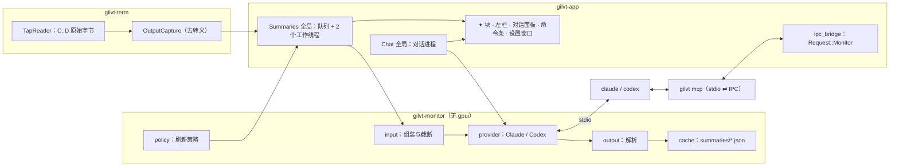

# gilvt 监控官 S2：AI 总结 + 设置窗口 + 只读对话 设计

- 日期：2026-10-05
- 状态：设计已确认；**阶段 1–4 已实现**
- 总体设计：[`2026-10-05-gilvt-agent-monitor-design.md`](2026-10-05-gilvt-agent-monitor-design.md)。本期合并了原计划的 S2 与 S3，S4（写操作、权限闸门、编排）不变。
- 前置：[`2026-10-05-gilvt-monitor-s1-activity-view-design.md`](2026-10-05-gilvt-monitor-s1-activity-view-design.md)（已实现）
- 界面稿（`2026-10-05-gilvt-monitor-mockups/`）：
  - `s2-card-states.html`：✦ 块的各种状态与左栏摘要行（顶部的「站会简报块」已被对话消息取代，以 `s2-chat.html` 为准）
  - `s2-briefing-options.html`：站会简报排版 A / B / C（选定 **B**）
  - `s2-chat.html`：对话面板、`@` 选会话、底部命令条、窄屏竖条、出错状态
  - `s2-settings.html`：`⌘,` 设置窗口（模型项已改为下拉，见 §5.2）

## 1. 目标与范围

S1 交付了不调用模型的卡片墙。S2 让用户：

1. **补课**：每张卡片、左栏每一行都有 ✦ AI 总结（Agent：目标 + 近期；终端：近期）。
2. **问监控官**：在「◎ 监控官」标签页右侧的对话面板，或任意标签底部的命令条里，用自然语言询问整体或某个会话的情况，包括「✦ 生成站会简报」。
3. **配置**：`⌘,` 设置窗口里开关监控官、选择 Claude / Codex 与模型、设置自动刷新、排除目录、测试连接。

**包含**

- 命令块精确输出捕获，恢复 S1 推迟的失败报错行。
- `gilvt-monitor` crate：Provider（Claude / Codex 的一次性调用与多轮对话）、prompt 组装、刷新策略、总结缓存。
- ✦ 总结块、左栏摘要行。
- `gilvt mcp`：stdio MCP server，只有只读工具。
- 对话面板、底部命令条、站会简报（对话里的一个快捷问题）。
- `⌘,` 设置窗口（只有「监控官」页）、`[monitor]` 配置、`config.toml` 写回与热重载。
- DebugState、验收清单 Z 节、假大脑。

**不包含**（S4）：任何写入 pane 的工具、权限闸门、计划 / 确认卡片、pane 紫边、编排器、审计、`danger_rules` / `default_mode`、◎ 启动标记。

**原则**：本期监控官只读。`gilvt-agent-terminal-design.md` P1 改为「gilvt 自身只观察；监控官可以通过 gilvt 的只读工具读取会话数据（读屏会明示）。写入 pane 的能力在 S4 引入并经过权限闸门」。

## 2. 架构



- 所有模型调用、子进程 IO 都在后台线程。UI 只读不可变快照（`Arc<SummaryView>`、`Arc<ChatView>`，带 `revision`），沿用 `TimelineView` 模式。
- 有变化时：总结用 `workspace::notify_sessions(&keys)`，对话 / 设置用 `workspace::notify_all`。

## 3. 精确输出捕获（gilvt-term）

### 3.1 问题

S1 在 UI 收到 C / D 事件时读光标行。alacritty 的事件循环在拿不到锁时会连读多块再解析，所以事件到达时可能已经解析到下一个提示符，摘录会混入提示符（S1 §3.4 第 3 条）。

### 3.2 做法

不再按行号截取输出，改为在 `TapReader` 里直接收集 C 与 D 之间的原始字节：

- 新增 `OutputCapture`（`gilvt-term/src/capture.rs`，纯逻辑）：
  - `on_command_start()`：清空，开始收集。
  - `feed(&[u8])`：只在收集中追加，环形保留最后 64KB；出现进入备用屏幕的序列（`CSI ? 1049 h` / `? 47 h` / `? 1047 h`）时标记 `alt_screen = true`，此后不再保存。
  - `finish() -> Option<String>`：备用屏幕返回 `None`；否则用 `vte` 解析，丢弃 CSI / OSC / DCS，按 `\r`（回到行首、后续字符覆盖）、`\n`、`\t`、`\b` 还原文本，去掉行尾空白与末尾空行，取最后 40 行再截到 4KB（UTF-8 边界）。
- `TapReader::read` 按扫描顺序处理：同一块缓冲区里，D 之前的字节归入当前块，C 之后的字节归入新块。为此 `OscScanner::feed` 要额外返回每个序列在缓冲区里的结束偏移（不改变现有调用方的行为）。
- D 到达时先发 `TermEvent::CommandOutput(Option<String>)`，再发 `TermEvent::Prompt(CommandEnd)`；`CommandLog` 把前者暂存，在 D 处理时填进 `output_tail`，替换 S1 按行号读取的结果。
- `start_line` / `end_line` 保持 S1 的近似值，只用于跳回终端。

### 3.3 报错行恢复

- 最后一条命令失败（`exit != 0`）时，终端卡片显示 `output_tail` 的最后一个非空行（红色、等宽、单行省略），即 S1 的 `error_line`。
- DebugState 终端 pane 的 `commands[]` 加 `error_line`。

## 4. AI 总结

### 4.1 Provider（`gilvt-monitor/src/provider/`）

```rust
pub trait Provider: Send + Sync {
    fn summarize(&self, req: &OneShot, deadline: Instant) -> Result<String, ProviderError>;
    fn start_chat(&self, cfg: &ChatConfig) -> Result<Box<dyn ChatProcess>, ProviderError>;
    fn list_models(&self, deadline: Instant) -> Result<Vec<ModelChoice>, ProviderError>;
}

pub enum ProviderError {
    NotFound { program: String },   // 找不到 CLI
    Auth(String),                   // 未登录 / 认证失败
    Timeout,
    Exited { code: Option<i32>, stderr_tail: String },
    Protocol(String),               // 输出无法解析
    Unsupported(String),            // 例如 Codex 缺少必须的 feature 开关
}
```

一次性总结：

| 通道 | 命令 |
|---|---|
| Claude | `claude -p --output-format json --tools "" --strict-mcp-config --no-session-persistence --settings '{"disableAllHooks":true}' --system-prompt <总结指令> [--model M]`，prompt 走 stdin，取 `result` |
| Codex | `codex exec --json --ephemeral -s read-only --skip-git-repo-check --disable hooks --disable shell_tool --disable unified_exec -c web_search="disabled" -c notify=[] [-m M] -o <临时文件> -`，prompt 走 stdin，取 `-o` 文件 |

- cwd 为 `state/monitor/run/` 下的临时目录。环境变量沿用 `launch::scrub_inherited_agent_env` 的清理规则，并去掉 `GILVT_SOCKET` / `GILVT_PANE_ID`，以免触发 shell 集成。
- 执行方式参照 `gilvt_agent::git::run_git_with`：null / 管道 stdin，两个线程分别读 stdout 和 stderr，轮询 `try_wait`，超时（90 秒）后 kill。
- `command` 非空时替换可执行文件路径（例如 `codex-w`），参数照常追加。
- 错误分类：退出码非零时按 stderr / JSON 里的关键字归为 `Auth`（`not logged in`、`authentication`、`401`、`login`），否则为 `Exited`。分类规则放在 fixture 测试里。
- **自检防护**：gilvt 自己拉起的进程不会被识别成 Agent 会话：
  - 进程扫描按祖先 `gilvt-app` 跳过（现有逻辑）。
  - 关闭 hooks，不会触发用户的全局 hooks。
  - 不保留会话记录，不会出现在历史里。
  - 不在任何 pane 里运行，pane 轮询也看不到它。

### 4.2 输入（`input.rs`）

- **Agent 首次总结**：当前轮 + 上一轮的 `Turn`，包括 prompt 首段、每个工具一行（工具名 + summary + 成败 + `error_excerpt`，每个工具 ≤ 4KB）、改动文件与 +/−、`reply`、TODO、状态（需要你时带上等待的审批内容）。
- **滚动更新**：输入改为「上一份总结 + 上次覆盖之后的新增事件」，不再重读全量。
- **终端**：最近 10 条命令块（命令首行、cwd、退出码、耗时、`output_tail` 最后 40 行）。
- 总长上限 24KB，超过时从最旧的条目开始丢，并注明「已省略 N 条」。
- `exclude_paths`：会话 cwd（或终端 cwd）在任一排除目录下（按规范化后的路径前缀判断，`~` 展开）时不生成输入。

### 4.3 输出（`output.rs`）

- 总结指令要求模型只输出两行：`目标：…`、`近期：…`（终端只要「近期」）。用中文，每行 ≤ 120 字，不要 Markdown。
- 解析：逐行匹配前缀（容忍全角 / 半角冒号与空白）。缺少「目标」时沿用上一份的目标；两个都缺时把全文当作「近期」，截到 3 行。

### 4.4 刷新策略（`policy.rs`，纯函数）

输入：配置（`auto_summary`、`summary_interval`）、会话的活动 revision（时间线 revision 或命令块 id）、上次总结覆盖到的 revision 与时间、状态变化事件、连续失败次数、是否手动。输出 `Decision::{Now(Priority), Later, Never}`。

- 手动：始终 `Now(Manual)`。
- `auto_summary = false`：只响应手动。
- 自动：没有新活动时 `Never`。有新活动时，满足以下任一条件且距上次自动总结 ≥ `summary_interval`，就 `Now`：
  - 刚发生 TurnEnd
  - 状态刚变成需要你 / 出错
  - 会话正在运行，且自上次总结已过 `summary_interval`
  - 终端有命令结束
- 被间隔挡住的触发记为待办，到时间后由 1 秒 ticker 再检查。
- 连续失败 3 次后自动刷新暂停（手动成功后清零）。
- 优先级：手动 > 需要你 / 出错 > TurnEnd / 命令结束 > 定时。

### 4.5 调度（gilvt-app `monitor/summaries.rs`）

- 全局 `Summaries`：一个按优先级排序的队列 + 2 个工作线程。同一 key 已在队列里时只更新输入与优先级，不重复入队；正在运行的 key 有新触发时，等它完成后再评估一次。
- 触发点：
  - `after_changes`（`agents/mod.rs:634`）：Added / Updated / Ended，以及状态变化。
  - 时间线 revision 变化：在现有的时间线排空处（`agents/mod.rs:413-445`）比较 revision。
  - 命令块结束：`terminal_view.rs` 收到 D。
  - 1 秒 ticker：处理被间隔挡住的待办。
- 结果写入 `SummaryView { goal, recent, generated_at, covers: Covers::Turns(a, b) | Covers::Commands(n), revision_covered, state, error }`，并落盘。
- `Agents::forget` 时删除对应的缓存文件。终端 pane 关闭时丢弃其总结（只在内存里）。

### 4.6 缓存

- Agent 会话的总结写到 `state/monitor/summaries/<sha1(key)>.json`（tmp + rename），启动时懒加载。终端的总结不落盘（命令块本身也不落盘）。
- 加载后，如果会话当前的 revision 大于 `revision_covered`，状态为 `stale`（「有新进展」）。

### 4.7 界面

- **✦ 块**：放在 Agent 卡片和终端卡片的标题行下（`monitor/view.rs:325` 预留位置），紫色系。
  - 头部：`✦ AI 总结 · <相对时间> · 覆盖第 a–b 轮`；终端写成 `覆盖最近 N 条命令`。
  - 正文：Agent 显示「目标」（单行省略）+「近期」（≤ 3 行）；终端只显示「近期」。
  - 状态：

| 状态 | 显示 |
|---|---|
| `pending`，没有旧总结 | 骨架「生成中…」 |
| `pending`，有旧总结 | 旧内容 + 头部「更新中…」 |
| `ready` | 正常显示 |
| `stale` | 正常显示 + 头部黄色「有新进展」 |
| `failed` | 头部 `✦ 总结失败：<原因> · 重试`；有旧总结时正文照常显示 |
| `paused`（连续失败） | 头部「已暂停自动总结 · 重试」 |
| `none` 且自动刷新关闭 | 只显示虚线按钮「✦ 生成总结」 |
| 未开启 / 被排除 | 整块不渲染 |

- 卡片按钮行增加「✦ 重新总结」与「◎ 问它」（S2 对话）。选中卡片后按 `S` 重新总结、`A` 问它（字母键，忽略带修饰键的情况，对输入法安全）。
- **左栏**：`sidebar_summary = true` 时，在状态行与位置行之间（`sidebar/view.rs:526` 之后）加一行 `✦ <近期第一句>`，10.5px 紫色、单行省略。只显示已有的总结，不会为左栏额外触发总结。

## 5. 设置

### 5.1 配置

`settings.rs` 新增 `MonitorSettings`（`#[serde(default, deny_unknown_fields)]`，挂在 `Settings.monitor`）：

```toml
[monitor]
enabled = false            # 总开关；false 时只有 S1 的卡片墙，不外发任何数据
provider = "claude"        # claude | codex，对话与总结共用
model = ""                 # 对话模型，空 = CLI 默认
summary_model = ""         # 总结模型，空 = 同 model
command = ""               # 自定义 CLI 路径 / 包装脚本，空 = 在 PATH 里查找 claude / codex
auto_summary = true
summary_interval = "2m"    # 支持 s / m / h；小于 30s 按 30s 处理
sidebar_summary = true
exclude_paths = []         # 支持 ~
```

- 写回：用 `toml_edit`（gilvt-app 新增 `toml_edit.workspace = true`）。每次写回前**重新读取磁盘上的文件**，只改动这一个键（必要时新建 `[monitor]` 表），保留注释与格式，tmp + rename。文件不存在时新建，只写 `[monitor]` 表。
- 热重载：用 `notify` 监视配置文件所在目录（编辑器常用改名保存），去抖 200ms 后重新 `Settings::load`，`update_global::<AppSettings>` 并刷新所有窗口。gilvt 自己写回触发的事件，通过比较内容哈希忽略。
- 生效：
  - `enabled` 由开变关：停止对话进程，清空总结队列，界面上的 ✦ 块与对话面板消失。缓存保留。
  - `provider` / `model` / `command` 变化：下一次调用生效；对话进程在下一条消息时按新配置重启，并提示「已切换到 …」。
- 语法错误：沿用 `Settings::load` 返回的错误信息。此时设置窗口顶部显示黄色提示，所有控件只读；内存里保留上一次有效的配置，而不是退回默认值（启动时首次加载失败才用默认值，与现状一致）。

### 5.2 设置窗口

- 新 action `OpenSettings`，绑定 `cmd-,`，并放进应用菜单「gilvt → 设置…」。窗口唯一，已打开时只聚焦。
- 新窗口类型 `SettingsWindow`（`gilvt-app/src/settings_window/`），720×560、可缩放。左侧导航只有「◎ 监控官」，右侧是表单：
  - **总开关**：启用监控官。
  - **模型**：
    - 通道（Claude / Codex 分段按钮）。
    - 对话模型、总结模型都是下拉框：
      - Claude 固定为 `CLI 默认`、`fable`、`opus`、`sonnet`、`haiku`。
      - Codex 来自 app-server 的 `model/list`：打开页面时拉取一次，旁边有「↻ 刷新」；拉取失败时只有 `CLI 默认` 并显示原因。
      - 总结模型的下拉框多一个 `同对话模型`。
      - 最后一项都是「其他…」：弹出输入框，用这个名字试跑一次总结，**成功才写入**，失败时提示「模型不存在或无权使用」，原值不变。
      - 配置里的值不在列表里时，显示 `<值> ⚠ 不在列表中`。
      - 切换通道时把两个模型重置为 `CLI 默认`。
    - 自定义 CLI 路径：文本框 + 「选择…」（文件选择器）。
    - 「测试连接」：试跑一次总结和一次对话（对话里调用一次 `list_sessions`），显示 CLI 版本、认证、两次耗时；失败时显示 `ProviderError` 对应的文案与建议。
  - **✦ AI 总结**：自动刷新开关、最小间隔（1m / 2m / 5m / 10m 分段，配置里的其他值显示为「自定义：<值>」）、左栏显示摘要行。
  - **隐私**：排除目录列表（每项可删，「＋ 添加…」打开目录选择器）。
  - 页脚：配置文件路径 +「在编辑器中打开」（`open -t`）。
- 退出逻辑：`main.rs:96-101` 改为「没有 Workspace 窗口时退出」，退出前关闭设置窗口。`ipc_bridge`、`nav` 已经按 `downcast::<Workspace>()` 过滤，不受影响；`debug_state/rects.rs:261` 遍历所有窗口时要能处理设置窗口（导出为 `settings` 条目）。

## 6. 只读对话

### 6.1 `gilvt mcp`

- gilvt-cli 新子命令 `gilvt mcp`：在 stdio 上手写一个最小的 MCP server（JSON-RPC 2.0，换行分隔），实现 `initialize`、`notifications/initialized`、`tools/list`、`tools/call`、`ping`，其他方法返回 `-32601`。
- 从环境变量读取 `GILVT_SOCKET` 与 `GILVT_MONITOR_TOKEN`；缺任何一个就以错误退出。
- 每次 `tools/call` 转成 `Request::Monitor { token, tool, args }` 发给 app。app 在主线程上按 Query 模式回答（`QUERY_TIMEOUT` 4 秒，超时返回 `isError: true`「gilvt 繁忙」）。
- **token**：app 每次启动对话进程（以及「测试连接」）时生成 128 位随机 token，只有当前有效的 token 被接受，旧 token 立即作废。
- 工具（全部只读；`exclude_paths` 下的会话一律视为不存在）：

| 工具 | 参数 | 返回 |
|---|---|---|
| `list_sessions` | — | 所有窗口的 Agent 会话与终端：key、种类、名称、分组、状态行、位置、cwd、git、✦ 总结（若有） |
| `get_session` | `key` | 同上 + TODO、上下文、各轮概要（轮号、prompt 首行、结果、耗时、+/−） |
| `get_timeline` | `key`, `turns`（如 `[3]` 或 `"last:2"`，最多 3 轮） | 这些轮的工具调用与结果（按 §4.2 截断） |
| `get_commands` | `key`（`pane:<id>`）, `limit ≤ 20` | 命令块（含精确 `output_tail`） |
| `read_screen` | `key`, `lines ≤ 200` | pane 可见区 + 回滚区的最后 N 行文本 |

- 每次工具调用都在对话里留下一行可见记录（§6.4）。

### 6.2 对话进程

- **Claude**：
  - 启动：`claude -p --input-format stream-json --output-format stream-json --verbose --tools "" --mcp-config <state/monitor/run/mcp-<pid>.json> --strict-mcp-config --no-session-persistence --settings '{"disableAllHooks":true}' --system-prompt <对话指令> --permission-mode dontAsk [--model M]`（`dontAsk`：不跟随用户的 `permissions.defaultMode`，`--allowedTools` 之外一律拒绝）。
  - MCP 配置把 `gilvt mcp` 作为唯一的 server，并通过 `env` 传入 socket 与 token。
  - 每条用户消息写一行 `{"type":"user","message":{…}}`。从输出里读取 `assistant` 文本增量、`tool_use` / `tool_result`（用于显示工具调用行）、`result`（本轮结束）。
- **Codex**：
  - 启动：`codex app-server`，带上总体设计 §4.1 的全部 `--disable` 参数、`web_search="disabled"`、`notify=[]`（用户的 notify 程序会收到回答并继承 token 环境变量）、`mcp_servers.gilvt.{command,args,env}` 和 `mcp_servers.gilvt.default_tools_approval_mode="approve"`，以及 `--disable hooks`。
  - 握手顺序：`initialize` → `thread/start { sandbox: "read-only", approvalPolicy: "never", ephemeral: true, developerInstructions: <对话指令>, model?, cwd: <临时目录> }` → 每条消息 `turn/start`。读取 item / delta 通知。中断用 `turn/interrupt { threadId, turnId }`。模型列表用 `model/list`（分页，`cursor` / `nextCursor`）。
  - 启动前用 `codex features list` 核对 `shell_tool`、`unified_exec`、`hooks` 能否关闭。缺任何一个就返回 `Unsupported`，对话面板显示拒绝原因（总结不受影响）。其余开关缺失时只记日志。
- **对话指令**要点：
  - 你是 gilvt 的监控官，只能通过 gilvt 工具读取会话数据，不能也不要声称执行任何操作。
  - 用中文，简洁。
  - 提到会话时写成 `[名称](gilvt://session/<key>)`。
  - 用户消息里的 `<scope keys="…"/>` 表示优先关注这些会话。
  - 「站会简报」请求按固定版式输出：先 `### 要你处理`（每项一行：会话链接 + 要做的事），再 `### 整体`（一段话）。
- **生命周期**：
  - 发第一条消息时才启动进程。全局只有一个进程，所有窗口共享。
  - 空闲 30 分钟后结束进程，UI 历史保留；下一条消息重新拉起，并在第一条消息前附上最近 6 轮问答的摘要（每条 ≤ 1KB）作为前情。
  - 「新对话」：清空历史，重启进程。
  - 回答中发新消息：先中断当前轮（Claude 发 stream-json 的 `control_request` / `interrupt`，Codex 发 `turn/interrupt`；两者都以录制的 fixture 为准），再发新消息。
  - 「停止」按钮只中断当前轮。
  - 每轮 5 分钟没有任何输出就当作超时，中断该轮。
  - gilvt 退出时结束进程。
- **历史只在内存里**，重启 gilvt 后清空，不落盘。

### 6.3 范围

- 卡片上点「◎ 问它」或按 `A`：打开 / 聚焦对话面板，输入框里加入这个会话的 chip。
- 输入框里打 `@`：弹出候选列表（顺序与卡片墙一致，继续输入可以过滤），⏎ 选中后变成 chip；可以选多个，chip 上的 `×` 移除。
- 发送时，把 `<scope keys="agent:codex:…"/>` 加在消息前面（UI 不显示），chip 随消息一起保留在气泡上。

### 6.4 界面

- **对话面板**：监控官标签页右侧，宽 360px。
  - 标签页宽度小于 760px 时收起成右边缘 26px 的「◎」竖条（有未读回答时带角标），点击展开为浮层。
  - 头部：`◎ 监控官`、`通道 · 模型 ▾`（点击打开设置窗口）、状态 pill（启动中 / 回答中 / 出错）、「停止」（回答中才有）、「新对话」、收起按钮 `⇥`。
  - 消息：
    - 用户消息右对齐。
    - 监控官回答以流式方式渲染 Markdown（复用 gilvt-markdown）。
    - 工具调用显示为灰色小字行，例如「✓ 已读取 web-login 第 2–3 轮时间线」，正在进行时显示「… 正在读取 …」。
    - `gilvt://session/<key>` 链接点击后跳到该会话，行为与左栏点击一致。
  - 快捷问题：「✦ 生成站会简报」「哪些需要我？」「有什么出错了？」，点击直接发送。
  - 输入框：`⏎` 发送，`⇧⏎` 换行，`@` 选会话。
  - 错误：进程启动失败或 `Unsupported` 时显示红色说明卡，带「打开设置」「查看日志」。
- **底部命令条**：每个 Workspace 窗口底部都有（`enabled = false` 时不显示）。
  - 收起时：一条 20px 的细线，显示「◎ 监控官 · 回答中…」/ 最近一条回答的首句 / 「⌘⇧M 提问」。
  - `⌘⇧M`（新 action `ToggleCommandBar`）：展开并聚焦输入框，上方弹出最近一轮问答和「在监控官中查看 ↗」（跳到本窗口的监控官标签页，没有就新建）。`Esc` 或再按 `⌘⇧M` 收起，焦点还给之前的 pane。
  - 命令条和面板显示的是同一条对话。
- **未开启**时：对话面板、命令条、「◎ 问它」都不出现。

## 7. 错误处理

| 情况 | 处理 |
|---|---|
| 找不到 CLI | `NotFound`。卡片 / 对话 / 设置页统一显示「未找到 claude，请在设置里指定 CLI 路径」 |
| 认证失败 | `Auth`。显示「claude 认证失败（请在终端运行 claude 登录）」，Codex 同理 |
| 总结超时（90s） / 进程退出 | 显示「超时」/「退出码 N」+ stderr 末行；计入连续失败 |
| 连续失败 3 次 | 该会话暂停自动总结，显示「已暂停自动总结 · 重试」 |
| 总结格式不对 | 按 §4.3 容错，不算失败 |
| stream-json / JSON-RPC 坏行 | 记日志并跳过；连续 20 行坏行就当作进程出错，结束进程，对话里显示错误 |
| 对话进程意外退出 | 对话里显示「监控官进程已退出（…）」，下一条消息自动重启 |
| MCP：token 错 / 会话不存在 / 被排除 / app 繁忙 | 返回 `isError: true` 的工具结果和一句原因，不会让进程崩溃 |
| 写回 config.toml 失败 | 设置页显示红色提示；内存里的修改仍然生效 |
| Codex `model/list` 失败 | 下拉框只有 `CLI 默认`，显示原因与「↻ 刷新」 |

所有子进程都记录在 app 内，gilvt 退出时结束（先 SIGTERM，1 秒后 SIGKILL）。

## 8. DebugState

字段只增不改，`docs/debug-state.md` 同步更新。

- `windows[].monitor.cards[].summary`：`{state, goal, recent, generated_at, covers, error, rect}`，另有 `resummarize`、`ask` 两个按钮的 `rect`。
- 终端 pane 的 `commands[].error_line`。
- 左栏 `Row.summary`：字符串或 null。
- `windows[].monitor.chat`（面板可见时）：`{collapsed, status, provider, model, scope: [key], messages: [{role, text, tools: [{name, label, done}], links: [{key, rect}], rect}], quick: [{label, rect}], input: {text, chips, rect}, rect}`。
- `windows[].command_bar`：`{expanded, line, popup_text, input_rect, rect}`。
- `settings`（设置窗口打开时，顶层字段）：`{page, readonly, error, fields: [{id, value, options, rect}], test: {state, text}}`。
- `chat_process`（顶层）：`{running, provider, pid, turns}`，用于断言进程生命周期。
- 新 `RectId`：`MonitorSummary(n)`、`MonitorResummarize(n)`、`MonitorAsk(n)`、`ChatMessage(n)`、`ChatLink(n, j)`、`ChatQuick(n)`、`ChatInput`、`ChatRail`、`CommandBar`、`CommandBarInput`、`SettingsField(n)`。

## 9. 测试

**单元 / 集成**

- `gilvt-term` `capture`：
  - C / D 在同一块缓冲区、跨缓冲区，缓冲区在转义序列中间切断。
  - `\r` 进度条、ANSI 颜色、`\b`、制表符。
  - 备用屏幕；超过 64KB 的输出；UTF-8 截断。
- `gilvt-monitor`：
  - `input`：截断上限、滚动更新、`exclude_paths` 的前缀规则（`~`、符号链接、尾部斜杠）。
  - `output`：各种格式容错。
  - `policy`：全部决策路径（关闭自动、间隔挡住后由 ticker 补上、没有新活动、连续失败暂停与清零、优先级）。
  - `cache`：读写、stale 判定、删除。
  - Provider：用录制的 fixture 驱动（Claude json / stream-json、Codex exec jsonl / app-server JSON-RPC），覆盖成功、认证失败、超时、坏行、`features list` 缺开关。
- `gilvt mcp`：握手、`tools/list` 的 schema、每个工具的参数校验、token 校验、排除过滤、app 超时。
- `settings`：`toml_edit` 写回保留注释与键顺序、新建 `[monitor]` 表、语法错误只读、热重载忽略自己的写回、`summary_interval` 解析。
- 退出逻辑：只剩设置窗口时，应用会退出。

**假大脑**（`gilvt-fake-agent` 新增 `brain` 模式）

- 按剧本模拟 `claude -p`（json 一次性 / stream-json 多轮）、`codex exec --json`、`codex app-server`、`codex features list`。
- 剧本可以写：
  - 「调用 MCP 工具 X(args)」：它会真的按 MCP 配置拉起 `gilvt mcp`，并通过 stdio 调用工具。
  - 「流式回答 Y」「返回认证错误」「挂起 N 秒」。
- GUI 用例用 `command = <fake 路径>` 指向它。剧本纳入防脱节测试。真实 CLI 的格式以 fixture 为准，fixture 更新后同步假大脑。

## 10. 验收

`docs/compat-checklist.md` 新增「Z. 监控官：AI 总结与对话（S2）」，每行一个 `tests/gui/cases/R/Z<n>.md`：

| ID | 验收 | 方式 |
|---|---|---|
| R1 | 开启监控官，fake agent 一轮结束后，卡片出现 ✦ 目标 / 近期，左栏出现摘要行 | sandbox + 假大脑 |
| R2 | 关闭自动刷新时只显示「✦ 生成总结」，点击后才生成 | sandbox + 假大脑 |
| R3 | 总结失败（认证错误剧本）显示原因；「重试」成功后恢复正常 | sandbox + 假大脑 |
| R4 | zsh 里执行一个失败命令后，终端卡片显示精确的报错行（不含提示符），✦ 近期出现 | sandbox（真实 zsh）+ 假大脑 |
| R5 | 重启后缓存的总结仍在；会话有新活动时头部显示「有新进展」 | sandbox + 假大脑 |
| R6 | `exclude_paths` 下的会话没有 ✦ 块，`list_sessions` 里也没有 | sandbox + 假大脑 |
| R7 | 「✦ 生成站会简报」以 B 版式出现在对话里，点击会话链接能跳过去 | sandbox + 假大脑 |
| R8 | 「◎ 问它」带上范围 chip；回答流式出现，带工具调用行 | sandbox + 假大脑 |
| R9 | 终端标签里 `⌘⇧M` 呼出命令条，显示的对话与标签页一致；`Esc` 收起后焦点回到终端 | sandbox + 假大脑 |
| R10 | `⌘,` 打开设置，切换模型后 `config.toml` 只改了这一行，注释仍在；外部修改后设置页同步更新 | sandbox |
| R11 | 「其他…」模型试跑失败时，配置不变 | sandbox + 假大脑 |
| R12 | Codex 缺少 `shell_tool` 时，对话拒绝启动并说明原因，总结仍然可用 | sandbox + 假大脑 |
| R13 | 真实 Claude：总结一次 + 对话一轮（带一次 MCP 调用），历史里没有新会话 | 真实 claude（验证 CLI 协议没变） |
| R14 | 真实 Codex：同上，且 `~/.codex/sessions` 下没有新的 rollout | 真实 codex（同上） |

## 11. 实施分阶段

计划按四个可以独立合并的阶段写，每个阶段结束都能用，并各自带上本阶段的验收行：

1. **精确捕获 + Provider（一次性）+ ✦ 总结 + 左栏 + `[monitor]` 配置（手改生效）**：R1–R6
2. **设置窗口 + 写回 + 热重载 + 模型列表 + 测试连接**：R10、R11
3. **`gilvt mcp` + 对话进程（Claude / Codex）+ 对话面板 + 站会简报**：R7、R8、R12–R14
4. **底部命令条**：R9

## 12. 文档

- README「当前进度」、产品手册「监控官」一节：AI 总结、对话、设置；快捷键表新增 `⌘,`、`⌘⇧M`，卡片上的 `S` / `A`。
- `docs/debug-state.md`。
- `2026-09-23-agent-terminal-design.md`：P1 与非目标按 §1 改为只读版本（写操作部分留给 S4 再改）。
- 总体设计 §10 的子项目表：注明 S2 已合并 S3。
- 已知限制：
  - 输出捕获是去转义后的近似文本，全屏重绘类程序（`top` 等不进备用屏幕的）可能出现乱序。
  - 对话历史不跨重启保留。
  - Claude 的模型列表是固定别名。

## 13. 风险

| 风险 | 缓解 |
|---|---|
| CLI 输出格式变化 | Provider 隔离 + fixture 测试 + 假大脑；R13 / R14 用真实 CLI 回归 |
| Codex 绕过只读 | 关闭 shell / exec，只读沙箱，启动前核对 feature，缺失就拒绝启动 |
| 模型调用成本 | 默认关闭；可以关掉自动刷新；最小间隔；没有新活动不调用；滚动总结；可以给总结单独选小模型 |
| 隐私外发 | 默认关闭；结构化截断；`exclude_paths`；读屏在对话里明示 |
| 自检污染（被识别成会话、出现在历史里） | 关闭 hooks + 不保留记录 + 进程扫描跳过 + R13 / R14 断言 |
| 范围大 | 四阶段，每阶段可以独立合并 |
